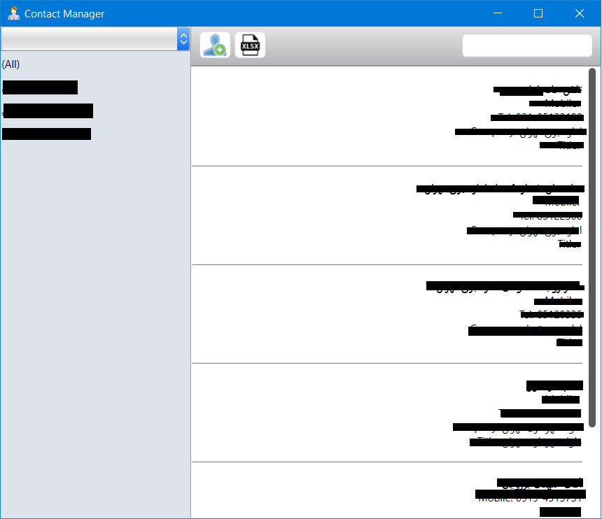
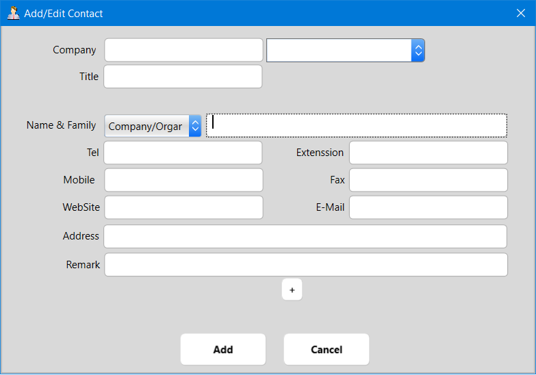

# WPF.ContactMgmr
Simple Contact Manager in wpf
* add key/value extra field :heart_eyes:
* access database (no need to install office or sql or ....) :heart_eyes:
* portable :heart_eyes:
* real time search contact
* group contact
* export excel

# main form

# add edit Form

